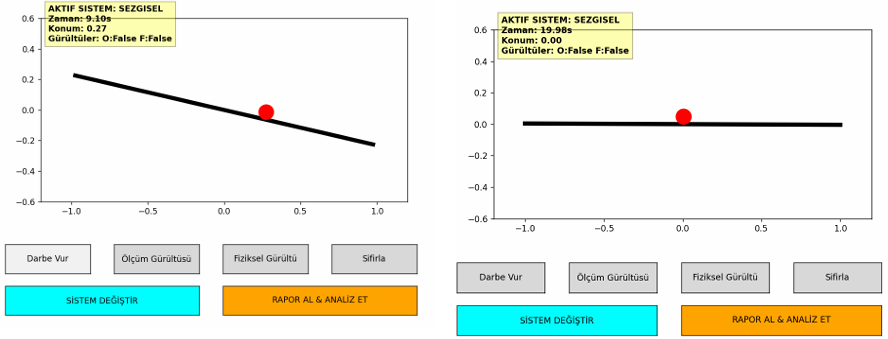

# Fuzzy Logic Control of Ball-and-Beam System

This project presents the design and comparison of two different fuzzy logic controllers
for the control of a classic **Ball-and-Beam system**, which is an inherently unstable
nonlinear control problem.

## Project Scope

Two fuzzy control approaches are implemented and analyzed:

1. **Intuitive (Rule-Based) Fuzzy Controller**
   - Rules are manually designed based on human intuition and experience.

2. **Model-Based Automatic Fuzzy Controller (PD-Based)**
   - Rules are generated algorithmically using a simplified PD control model.

The main objective of both controllers is to keep the ball balanced at the center
of the beam (position = 0).

---

## System Description

### Inputs
- **Ball Position (x)** ∈ [-1, 1]
- **Ball Velocity (v)** ∈ [-1, 1]

### Output
- **Beam Angle (θ)** ∈ [-1, 1]

All variables are normalized for consistency and control stability.

---

## Controller Designs

### Intuitive Fuzzy Controller
- Membership Functions: Triangular
- Linguistic Variables:
  - Position: Left – Center – Right
  - Velocity: Negative – Zero – Positive
  - Output Angle: Left – Straight – Right
- Rule Base: 9 manually defined fuzzy rules

This controller relies on human-like reasoning and provides smooth and stable control
near the equilibrium point.

---

### Model-Based (PD-Based) Fuzzy Controller
- Rules are generated automatically
- Based on the following control effect:
  
  **effect = -position - 0.5 × velocity**

- Linguistic Labels: poor, average, good

This approach eliminates manual tuning and focuses on fast error correction,
but may introduce small oscillations around the equilibrium.

---

## Performance Comparison

| Criterion | Intuitive Controller | Model-Based Controller |
|---------|---------------------|------------------------|
| Stability | High | Medium |
| Response Speed | Medium–Fast | Fast |
| Oscillation | Low | Small oscillations |
| Noise Sensitivity | Low–Medium | Medium–High |
| Design Method | Manual | Algorithmic |

---

## Simulation Results

### Intuitive Fuzzy Controller

### Model-Based Fuzzy Controller

### Control Signal Comparison

### Ball Position Comparison

---

## Conclusion

The intuitive fuzzy controller provides smoother and more human-like responses,
while the model-based fuzzy controller achieves faster convergence using analytical
rule generation.

Both controllers demonstrate that fuzzy logic is an effective control strategy
for unstable nonlinear systems such as the Ball-and-Beam system.

---

